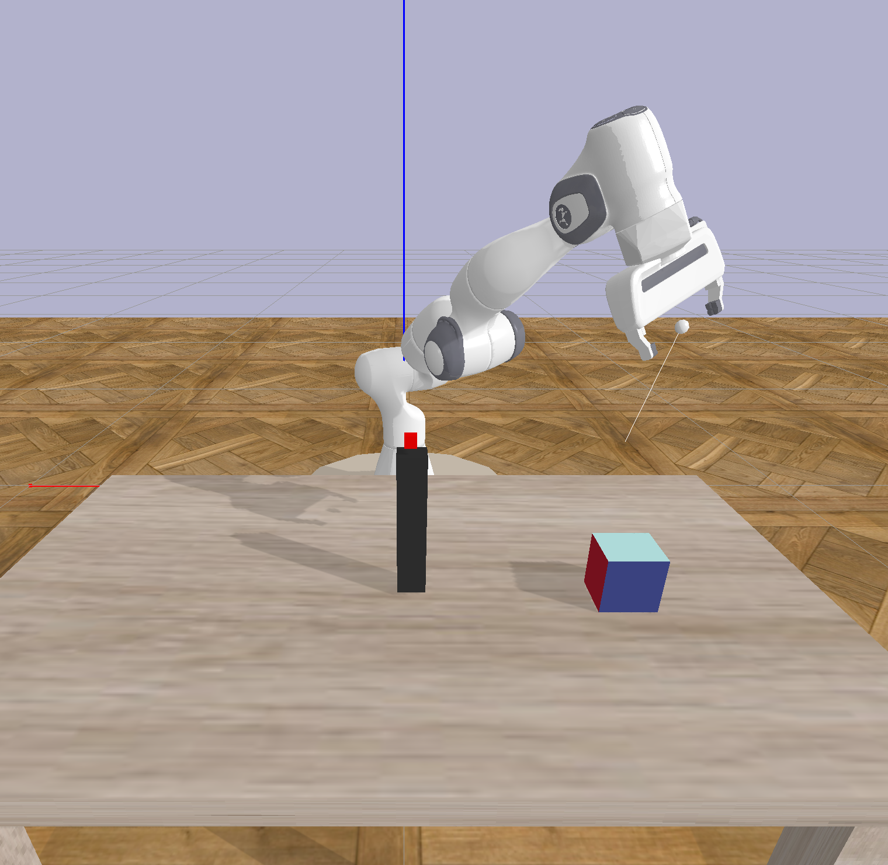

# Welcome to a robot weigthing their options

This repository has the aim to make a robot arm learn the importance of learning the mass distribution of an object. To this aim we designed a harder pick an place task where the goal is to balance an object on a pole with the difficulty that the object's center of mass is randomly shifted. We design this as a RL problem and go at it with two different approaches outlined below.  

Please see our blog post for a detailed description and result analysis. 
[blog post](https://thedingodile.github.io/Robotics/Weighing-My-Options.html)

This repository is a clone of the [myGym](https://github.com/incognite-lab/myGym), please refer to its documentation for further customizations. 

## Installation

Clone the repository:

`git clone https://github.com/mschoene/myGym.git`

`cd mygym`

Create Python 3.7 conda env as follows (later Python versions does not support TF 0.15.5 neccesary for Stable baselines ):

`conda env create -f environment.yml `

`conda activate mygym`

Install myGym:

`python setup.py develop`

If you face troubles with mpi4py dependency install the lib:

`sudo apt install libopenmpi-dev`

You can visualize the virtual gym env prior to the training. 

`python test.py --config configs/train_weighing_MLP.json`

## Baseline

We trained a simple two layer MLP with PPO as a baseline model without temporal information. 
To further train the pretrained model run:

`python train.py --config configs/train_weighing_MLP.json`

## Approach 1

To run the training for the shared LSTM backbone model run:

`python train.py --config configs/train_weighing_withCOMloss.json `

## Approach 2

Please checkout the second branch 

A dataset needs to be generated to train the LSTM, in the lstm_config put this value:

`"use_model": false`

and run the script, this will generate a dataset (and can be used as pre-training for the model, but is not necessary):

`python train.py --config configs/train_test_MS.json`

To train the lstm run, 

`python3 train_lstm.py`

To run the model with the lstm, change the value in the lstm_config file:

`"use_model": true`

and run

`python train.py --config configs/train_test_MS.json`

## Original myGym Authors

[Incognite lab - CIIRC CTU](https://incognite-lab.github.io) 

Core team:

[Michal Vavrecka](https://kognice.wixsite.com/vavrecka)

[Gabriela Sejnova](https://www.linkedin.com/in/gabriela-sejnova/)

[Megi Mejdrechova](https://www.linkedin.com/in/megi-mejdrechova)

[Nikita Sokovnin](https://www.linkedin.com/in/nikita-sokovnin-250939198/)

Contributors:

Radoslav Skoviera, Peter Basar, Michael Tesar, Vojtech Pospisil, Jiri Kulisek, Anastasia Ostapenko, Sara Thu Nguyen

## Citation

'@INPROCEEDINGS{9643210,
  author={Vavrecka, Michal and Sokovnin, Nikita and Mejdrechova, Megi and Sejnova, Gabriela},
  
  
  booktitle={2021 IEEE 33rd International Conference on Tools with Artificial Intelligence (ICTAI)}, 
  
  
  title={MyGym: Modular Toolkit for Visuomotor Robotic Tasks}, 
  
  
  year={2021},
  volume={},
  number={},
  pages={279-283},
  
  
  doi={10.1109/ICTAI52525.2021.00046}}'

## Paper

[myGym: Modular Toolkit for Visuomotor Robotic Tasks](https://arxiv.org/abs/2012.11643)
